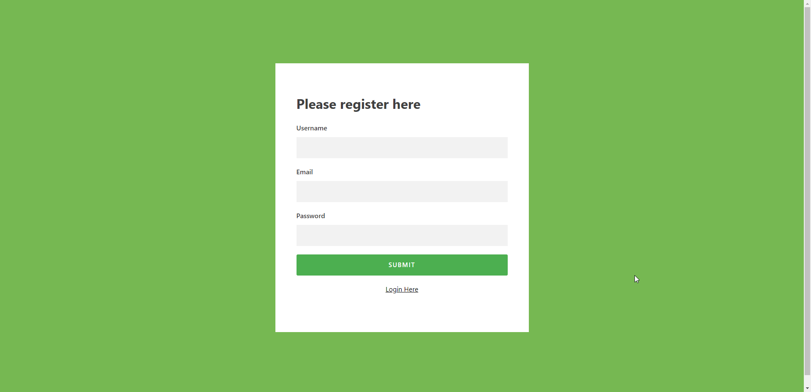
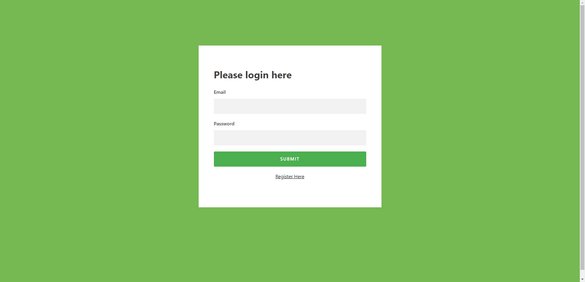
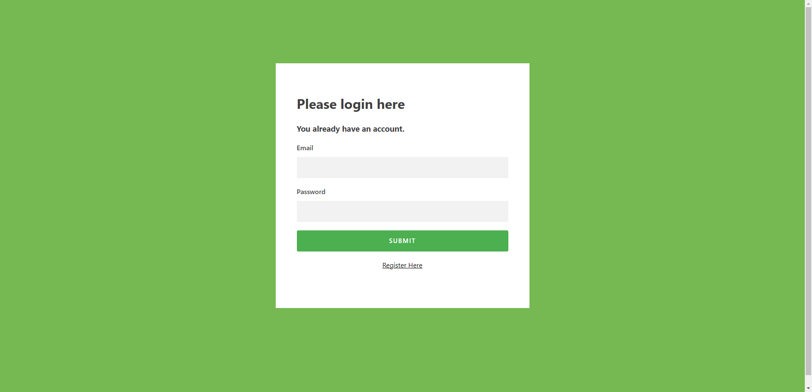
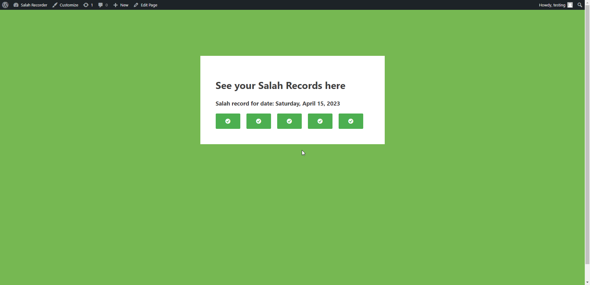
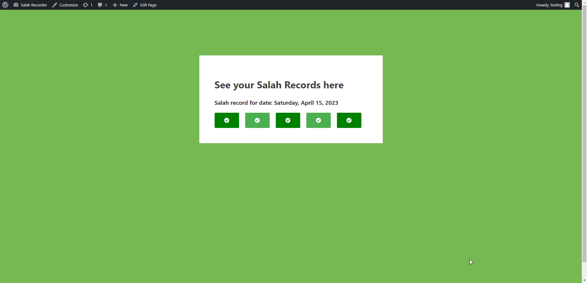
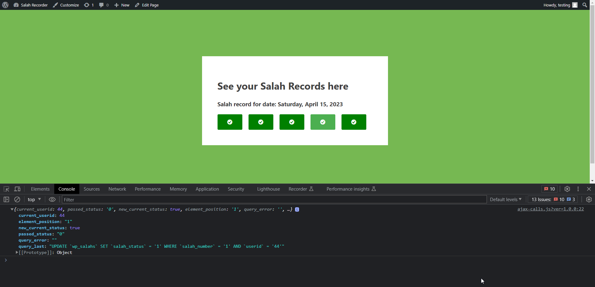

# Salah Recorder for Brand 786

This repository contains the source code for a WordPress theme that allows users to register and record their daily salah. The theme provides an easy way for users to keep track of their daily prayers and monitor their progress.

## Tasks

The following are the main tasks that this app can handle:

1) User registration and account creation: Users can create an account and register with the app. This allows them to keep track of their daily salah and monitor their progress for current day.

2) Daily salah tracking: Each day, the app presents the user with the specific day's five salahs. The user can then mark each salah as read once they have completed it.

## Technologies Used

This app was built using the following technologies:

- HTML/CSS: Used for front-end development and styling.
- jQuery: Used for implementing the app's functionality.
- PHP: Used for recording data in the backend.
- WordPress: Used as a CMS to manage the app's content.
- AJAX: Used to detect user updating a value from the frontend and send a request to the database to update the selected salah status in the database.
- MySQL: Used to store the salah data in the backend.

## Installation

To run this app on your WordPress website, follow the steps below:

- Download the repository and unzip it on your local machine.
- Upload the salah-recorder theme folder to your WordPress site's wp-content/themes/ directory.
- Log in to your WordPress dashboard and activate the Salah Recorder theme.
- Create a new page and assign the 'Homepage' template to it in order to display the app's output.
- Set that 'Homepage' as the front page of the website in order to avoid having to navigate to it after every single action.

## Functionality & Working of the App 

- **Automatic database table creation**: When you activate the theme, the app checks if there is a table called `$table_name = $wpdb->prefix . 'salahs'`; present in the database. If the table is present, it does nothing. If not present, it creates that table and here are the fields present in the table:

	- `userid`: to store the current user's WordPress-generated ID.
	- `salah_number`: to store the 1 to 5 numbers of salah.
	- `salah_status`: to store/update specific salah's status as marked or unmarked.
	- `last_login`: to save the last logged-in date of the user so that if the user logs in again after a day has passed, its value of the last date can be reset to display values of the current day.
 - **User Account Creation**: After you have activated the theme and set the homepage as the front page, you can test the functionality of the app by opening it in a not logged-in or incognito window. When you open the site, it will present you with a registration form that looks like the image below:
  
You can register here by providing your information, including your username, email address, and password. Once you have successfully registered, the app code runs and gets the current user's WordPress ID. It then creates new columns in the table to store null values against all five salahs for this user.

	This means that the user can now start tracking their daily salah by marking them as read on the app. The app will automatically update the database with the user's progress and allow them to view their previous salah records.

- **User login form**:

	- The user login form is displayed to the user in two circumstances. Firstly, if the user clicks on the "Login Here" link below the registration form. Here is an image of what the login form looks like:  

	- Secondly, if a user tries to create a username that is already taken, the app informs the user that the account is already created and prompts the user to log in with their existing credentials. The user can then use the same login form to log in.  

- **User Interaction with Salah Records**:

	- When a user logs in, they are presented with the current status of their salah. The page displays the 5 daily prayers of the day as checkboxes, and initially, all checkboxes are unmarked.  

	- When a user clicks on a checkbox to mark it, an AJAX request is sent to the database to update the corresponding salah status for that user. The request includes the current user's ID, and the specific salah number that has been marked. While the AJAX request is being processed, the user can see the salah status being updated on the screen. Once the AJAX request is completed, the salah status is updated in the database and the checkbox changes from light green to dark green.  

-  **User status cookie**:
	- All information related to user account creation, login, and logout is stored in a cookie called "user_status". This cookie is used to track the user's activity and display relevant information accordingly. For example, if the user has just created a new account, the app will display a welcome message and prompt the user to log in. If the user is already logged in, the app will display their dashboard and allow them to record their daily salah. If the user logs out, the app will display the login form again.

- **User logout behavior**:

	- When a user logs out, they will be redirected to the homepage of the app rather than the default WordPress login page. This ensures that the user stays within the design and experience of the app and does not get redirected to a different page.

- **User data reset behavior:**

    - When a user logs in again after a day has passed, the app resets their salah data to null values for all five salahs for that day. This is achieved by checking the last login date of the user, which is stored in the database, and comparing it to the current date. If the difference is greater than 1 day, the app resets the salah data for that user. This ensures that the user starts with a fresh slate each day and can track their salah progress accurately.

- **Logging of current passed value to AJAX request:**

	- Whenever a user interacts with the salah records by clicking on a checkbox, an AJAX request is sent to the database to update the corresponding value. To facilitate debugging and troubleshooting, a console log of the values being received from the AJAX request has been added. This log can be viewed in the console of the user's web browser, providing additional information on the current request.  

### Contributing

Contributions to this project are welcome. If you find any bugs or issues, or if you think my code is not according the requirements then please feel free to open an issue or submit a pull request with your changes.

#### License

This app is licensed under the MIT license.
